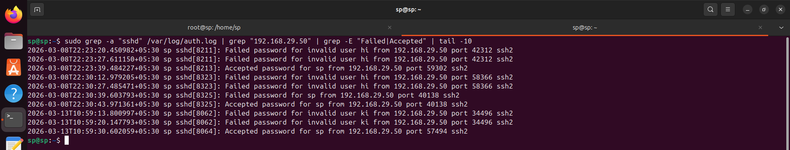
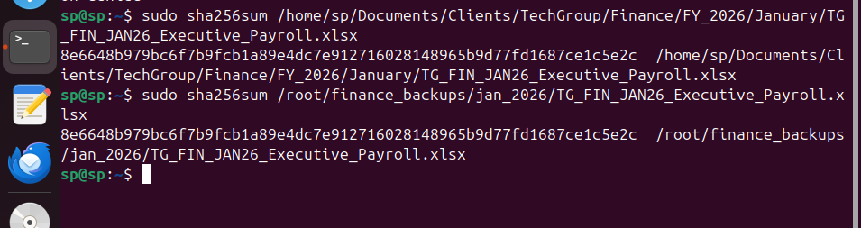
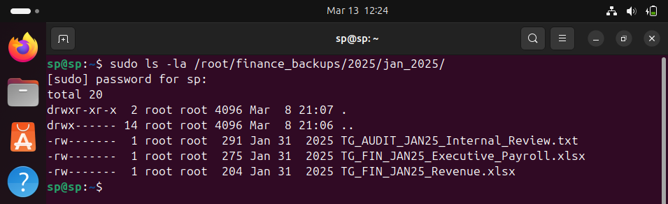
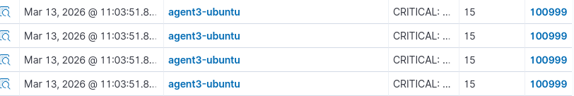
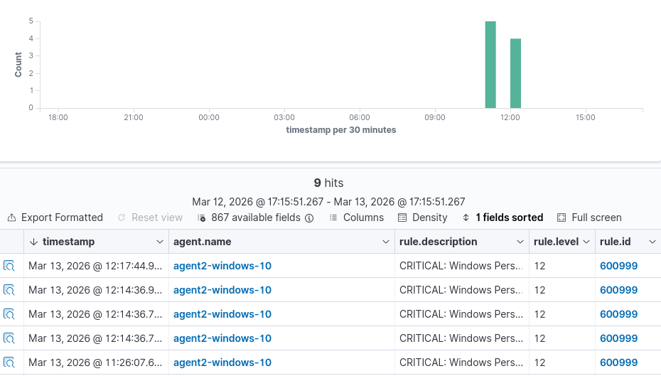
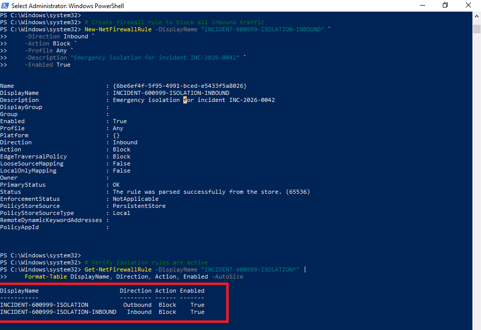
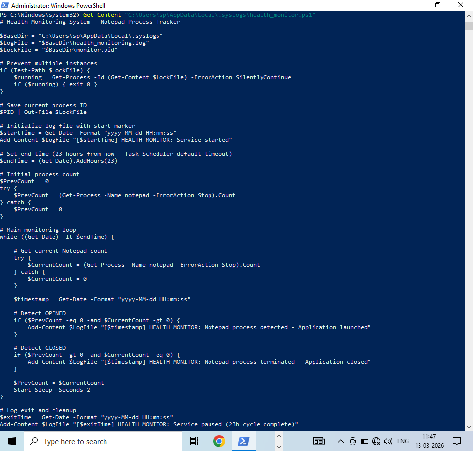
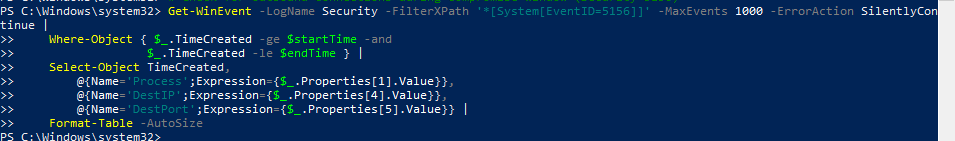

# Concurrent Security Alert Investigation and Evidence-Based Incident Prioritization

## Linux False Positive vs Windows True Threat

A professional SOC simulation demonstrating real world incident prioritization where a Level 15 Linux alert proves false while a Level 12 Windows alert requires immediate containment. This project showcases the ability to triage multiple concurrent alerts, make evidence based decisions, pause and resume investigations cleanly, and maintain composure when severity numbers do not tell the full story.

## The Challenge

When two critical alerts fire within minutes, how does an analyst decide where to focus?

| Alert | Severity | Initial Impression | Actual Verdict |
|-------|----------|-------------------|----------------|
| Linux (Ubuntu) | Level 15 | Appears malicious (SSH failures + finance access) | False Positive - Legitimate admin work |
| Windows | Level 12 | Moderate confidence | True Positive - Active persistence |

This project demonstrates that alert severity alone does not determine priority. Evidence, context, and impact drive the decision making process.

## Project Overview

The investigation follows this flow. While investigating Case 1 (Linux), a new Case 2 (Windows) is received at 11:26. Case 1 is paused because initial evidence confirms typographical SSH authentication errors. Case 2 shows clear indicators of active persistence that require immediate containment. After fully resolving Case 2 by 12:17, the investigation resumes on Case 1 and concludes as a false positive at 12:40.

This approach demonstrates proper incident triage by responding based on actual threat evidence rather than alert severity numbers.

### Incident 1: Linux False Positive (Level 15)

A Linux system generated high severity alerts showing SSH authentication failures followed by success, access to sensitive finance directories, sudo privilege escalation, and backup file creation. Initial investigation confirmed the SSH failures were typographical errors based on process ID analysis. The investigation was paused at 11:26 when a Windows alert was received.

### Incident 2: Windows True Positive (Level 12)

A Windows system produced a correlation alert at 11:26 based on PowerShell execution, hidden file creation, and scheduled task activity within the previous five minutes. Investigation revealed unauthorized SSH access from IP 192.168.29.50, reconnaissance commands, a hidden directory containing a masqueraded PowerShell script that tracked user activity, and a scheduled task created for persistence. The endpoint was isolated within two minutes and fully remediated.

## Investigation Timeline

| Time (IST) | Linux Incident | Windows Incident |
|------------|----------------|------------------|
| 10:17-10:37 |  | Legitimate user SSH sessions |
| 10:59 | SSH failures begin |  |
| 11:03 | Alert triggered (Level 15) |  |
| 11:13 | Ticket opened |  |
| 11:18 | SSH analysis complete - typo confirmed |  |
| 11:20 |  | Attacker SSH access |
| 11:21-11:25 |  | PowerShell, hidden file, schtasks events |
| 11:26 | Investigation PAUSED | Alert triggered (Level 12) |
| 11:27 |  | Ticket opened |
| 11:29 |  | Endpoint isolated |
| 11:32 |  | Account disabled |
| 11:36-11:54 |  | Investigation and remediation |
| 12:05-12:15 |  | Verification complete |
| 12:17 |  | Ticket closed - True Positive |
| 12:27 | Investigation RESUMED |  |
| 12:30-12:38 | Remaining analysis completed |  |
| 12:40 | Ticket closed - False Positive |  |

**Key Decision Point**

At 11:26 the Level 15 Linux investigation was paused because evidence already suggested typographical errors based on the same process ID. The Level 12 Windows incident showed clear indicators of active persistence that required immediate containment. Severity numbers alone did not determine priority. Evidence determined the priority.

## Linux Investigation: Proving the False Positive

### Critical Evidence: SSH Process ID Analysis

All three authentication attempts shared the same process ID `[8064]`. This confirmed they occurred within a single session and provided definitive proof of a typographical error.

| Time | Event | Process ID | Source IP |
|------|-------|------------|-----------|
| 10:59:13 | Failed attempt | sshd[8064] | 192.168.29.50 |
| 10:59:20 | Failed attempt | sshd[8064] | 192.168.29.50 |
| 10:59:30 | Successful attempt | sshd[8064] | 192.168.29.50 |

### File Integrity Verification

SHA256 hashes were identical between the original and backup files. This provided cryptographic proof that the files were exact copies with no modification.

### Established Practice: 2+ Year Backup Structure

Monthly backups since 2024 with consistent naming confirmed this was routine administrative activity and not anomalous behavior.

### Initial Alert

**Verdict:** False Positive - Legitimate administrative activity confirmed through multiple independent evidence sources.

## Windows Investigation: Containing the True Threat

### Initial Alert

### Immediate Containment

The endpoint was isolated within two minutes and the user account was disabled to prevent further attacker access.

### SSH Authentication Analysis

The attacker gained access at 11:20 from IP `192.168.29.50`, which was 43 minutes after the user's legitimate session.

### Malicious Script Analysis

A PowerShell script masquerading as **Health Monitoring** tracked `Notepad.exe` activity every two seconds. This behavior indicated persistence and automated collection activity.

SHA256  
`B086A540AF33E14A543416057AC1ACB5D72E3A27249CAFE62D9FB7FEAE2A28F6`

### Critical Finding: No Data Exfiltration

No outbound connections were detected during the compromise window. This confirmed successful containment before any data exfiltration occurred.

**Verdict:** True Positive - Fully remediated with no data loss.

## Key Decision Points

| Time | Decision | Rationale |
|------|----------|-----------|
| 11:18 | Continue Linux investigation | Typo identified but additional context required |
| 11:26 | Pause Linux investigation | Windows alert shows active persistence requiring immediate action |
| 11:29 | Isolate Windows endpoint | Prevent lateral movement and data exfiltration |
| 11:32 | Disable user account | Stop attacker access immediately |
| 12:27 | Resume Linux investigation | Windows incident resolved and remaining checks completed |

**Core Lesson**

A Level 15 alert was paused while a Level 12 alert required isolation. Severity numbers do not determine priority. Evidence determines priority.

## MITRE ATT&CK Mapping

### Ubuntu Incident

| Tactic | Technique ID | Technique Name | Observed Activity |
|--------|--------------|----------------|-------------------|
| Initial Access | T1078 | Valid Accounts | SSH with valid credentials |
| Execution | T1059.004 | Unix Shell | Bash command execution |
| Privilege Escalation | T1548.003 | Sudo and Sudo Caching | sudo -s escalation |
| Credential Access | T1110.001 | Password Guessing | Two failed SSH attempts |
| Collection | T1005 | Data from Local System | Finance file access |
| Collection | T1074.001 | Local Data Staging | Backup file creation |

### Windows Incident

| Tactic | Technique ID | Technique Name | Observed Activity |
|--------|--------------|----------------|-------------------|
| Initial Access | T1078 | Valid Accounts | SSH with compromised credentials |
| Execution | T1059.001 | PowerShell | Interactive PowerShell and script |
| Persistence | T1053.005 | Scheduled Task | NotepadMonitor task creation |
| Privilege Escalation | T1548.002 | Bypass User Account Control | /RL HIGHEST in schtasks |
| Defense Evasion | T1564.001 | Hidden Files and Directories | .syslogs hidden directory |
| Defense Evasion | T1564.003 | Hide Window | PowerShell -WindowStyle Hidden |
| Defense Evasion | T1027 | Obfuscated Files or Information | Script masquerading as health monitor |
| Discovery | T1033 | System Owner/User Discovery | whoami |
| Discovery | T1069 | Permission Groups Discovery | whoami /priv |
| Discovery | T1016 | System Network Configuration Discovery | ipconfig |
| Discovery | T1049 | System Network Connections Discovery | netstat -an |
| Collection | T1119 | Automated Collection | Process monitoring every two seconds |
| Collection | T1074 | Data Staged | health_monitoring.log local storage |

## Key Findings

| Finding | Linux (Level 15) | Windows (Level 12) |
|---------|------------------|--------------------|
| Initial Access | Legitimate credentials | Compromised credentials |
| Authentication | Same process ID [8064] indicating a typo | Different session after legitimate use |
| File Activity | Permission denied events | Hidden directory creation |
| Privilege Escalation | Authorized sudo | UAC bypass via schtasks |
| Persistence | None | Scheduled task created |
| Exfiltration | None | None because containment occurred in time |
| Verdict | False Positive | True Positive Remediated |

## Tools Used

| Tool | Purpose |
|------|---------|
| Wazuh SIEM | Alert detection and correlation |
| Sysmon | Windows process and file monitoring |
| auditd | Linux system call auditing and log integrity |
| Jira | Incident ticketing and tracking |

## License

This project is licensed under the MIT License. See the LICENSE file for details.
